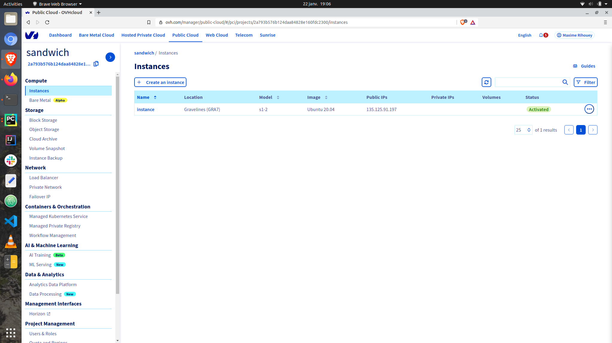
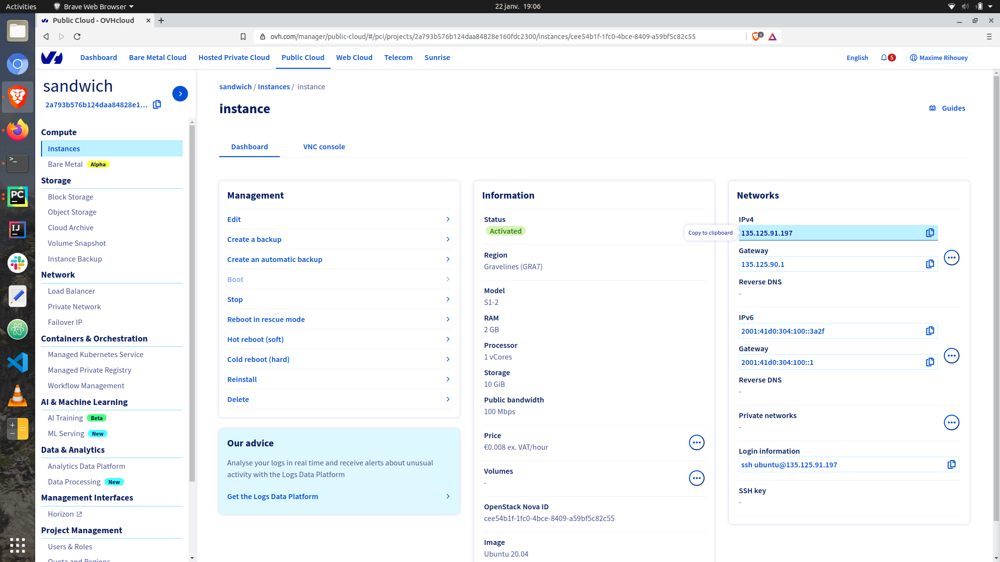
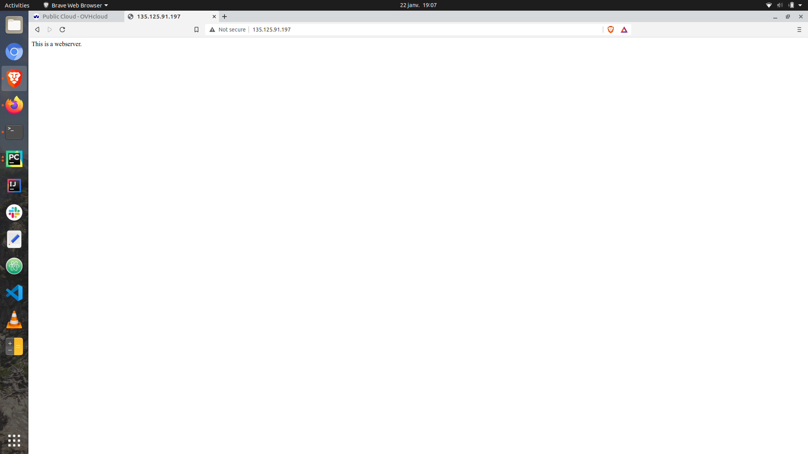

# Webserver on public instance


We are creating several resources:
- `openstack_compute_instance_v2` a VM instance where a python webserver will be running (achieved using *webserver.sh*)
- `openstack_networking_secgroup_v2` a Security Group with rules (`openstack_networking_secgroup_rule_v2`) to connect to allow access to the instance via SSH and HTTP
- `openstack_compute_keypair_v2` a KeyPair to connect to the VM instance 

The only element you might have to change is the path to the SSH KEY, you can specify it in the variable `ssh_key_location` that is defined in the file `variables.tf`.
In the `variables.tf` you can also see the usage of the credentials set up as environment variables. 

You can deploy the infrastructure by applying the `terraform` code:
```
terraform init
terraform apply
```

You should see the instance on your OVHcloud interface (you might have to refresh the page).





The instance is published pubicly on the web and you can access it by copying and paste the IP as a URL.
Once the `webserver.sh` is fully executed you should see the output of the python webserver.



I strongly advise destroying the instance afterwards:
```
terraform destroy
```
