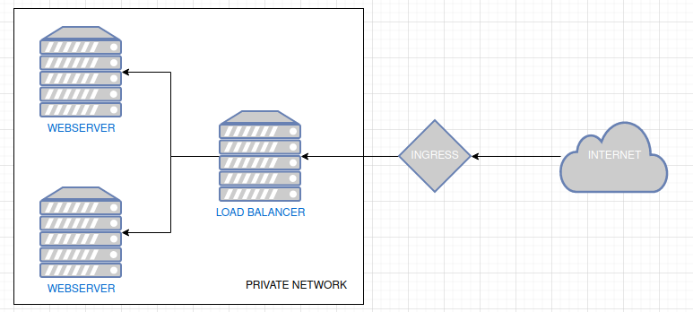
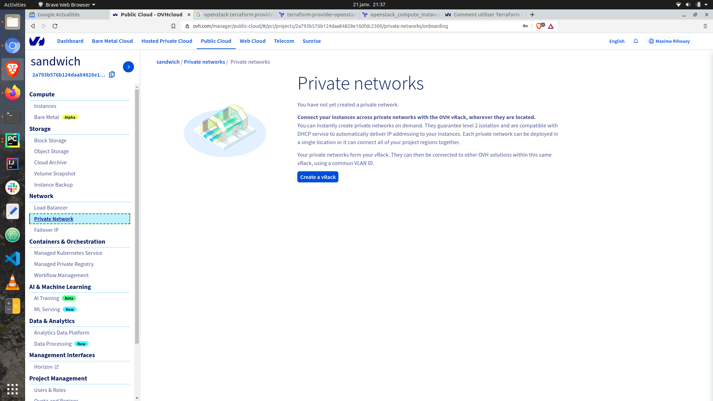
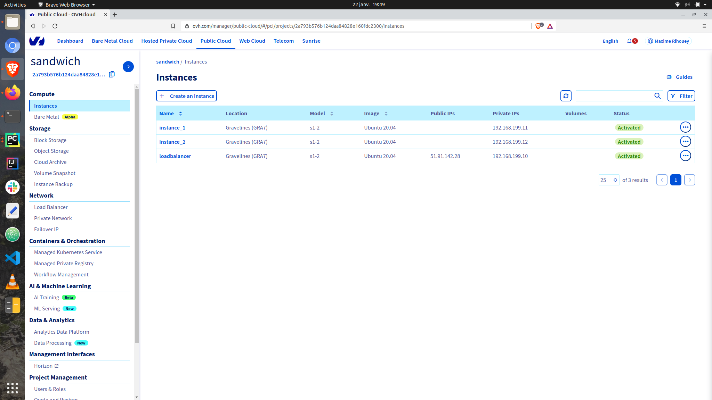
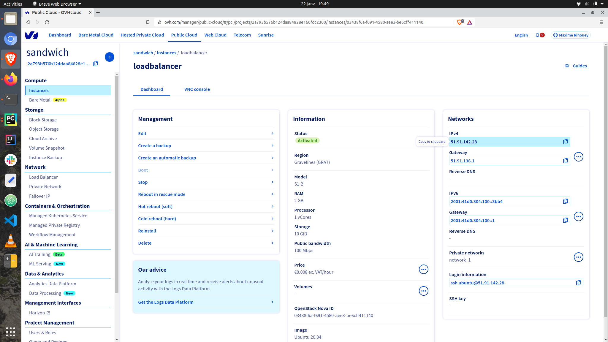

# Loadbalancer to 2 webservers in private network



First of all you need to create a vRack on the OVHcloud interface to allow the creation of private networks:



We are creating several resources:
- `openstack_networking_network_v2` a private network
- `openstack_networking_subnet_v2` a subnet on the private instance with CIDR "192.168.199.0/24" (allowing to set IPs from "192.168.199.0" to "192.168.199.23")
- 2 `openstack_compute_instance_v2` a VM instance where a python webserver will be running (achieved using *webserver.sh*), both are in a private network
- 1 `openstack_compute_instance_v2` a VM instance where a loadbalancer `haproxy` will be running (achieved using *haproxy.sh*), in a private network
- `openstack_networking_secgroup_v2` a Security Group with rules (`openstack_networking_secgroup_rule_v2`) to connect to allow access to the loadbalancer via SSH and HTTP
- `openstack_compute_keypair_v2` a KeyPair to connect to the VM instance loadbalancer 

The only element you might have to change is the path to the SSH KEY, you can specify it in the variable `ssh_key_location` that is defined in the file `variables.tf`.
In the `variables.tf` you can also see the usage of the credentials set up as environment variables. 

You can deploy the infrastructure by applying the `terraform` code:
```
terraform init
terraform apply
```

You should see the instances on your OVHcloud interface (you might have to refresh the page).




The instance `loadbalancer` is in the private network but an INGRESS (in the security group) allow to access it by copying and paste the IP as a URL (also SSH).
Once the user-data of all 3 instances is complete see the output of the python webserver alternating.


You might see an error `503 Sevice Unavailable` until both webservers are ready and the loadbalancer is set up.

I strongly advise destroying the instances afterwards:
```
terraform destroy
```
