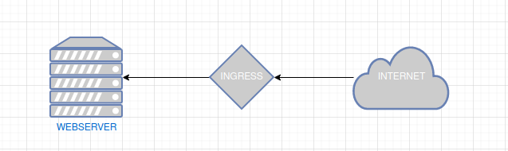
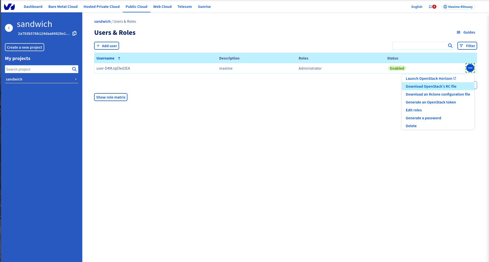
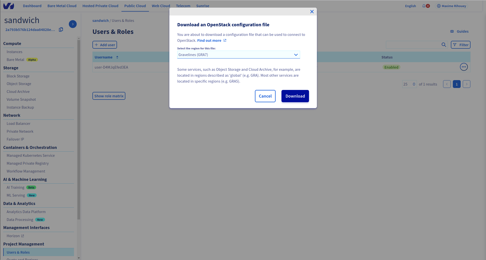

# Deploying a simple webserver on OVHcloud

This tutorial shows how to deploy a simple webserver on the OVHcloud using `terraform` and the OpenStack provider.

A few key pieces of information:
- We will deploy `out-of-the-box` NGINX servers, with no specific configuration
- We will use `terraform` in version `v0.12.30` (since the provider has not been ported to `v0.13` yet: https://github.com/terraform-provider-openstack/terraform-provider-openstack)
- We use a local `terraform` remote state
- There might be security issue having a public instance on the web, I am not an expert, so I strongly advise only keeping such instance online for testing purposes and destroying it afterwards.

# Tutorials

## 1) Webserver on public instance



Go to the folder [1-public-webserver](https://github.com/maximerihouey/ovh-cloud-simple-webserver/tree/main/1-public-webserver).

## 2) Loadbalancer to 2 webservers in private network


Go to the folder [2-loadbalancer-private-network](https://github.com/maximerihouey/ovh-cloud-simple-webserver/tree/main/2-loadbalancer-private-network).

# Prerequisites (things you need before starting the tutorial):
- An OVHcloud account, and a project
- An OpenStack user (https://docs.ovh.com/us/en/public-cloud/creation-and-deletion-of-openstack-user/)
- An SSH key (https://docs.ovh.com/us/en/public-cloud/create-ssh-keys/)
- A basic understanding of `terraform`

### Setting credentials for `terraform` (and `openstack`)

1. Download the `openrc.sh` for your OpenStack user

The OpenStack interface on OVHcloud let you download an executable that sets several environment variables:

 



To use it simply execute `source openrc.sh` (this will ask for your OpenStack user password).

To verify that everything works you can execute
```
openstack catalog list
```

2. Export your OpenStack user credentials as `terraform` environment variable.

In this tutorial we will use those credentials directly in the `terraform` code, instead having them clear in the code (and risking publishing it) it is better to set them as environment variables.

```
export TF_VAR_open_stack_user_name="user-D4MJqEfed3EA"
export TF_VAR_open_stack_password="XXXXXXXXXXXXXXXXXXXXXXXX"
```

# Remarks on the webserver

In this tutorial we setup a very simple python webserver, here is the code:
```
import http.server
import socketserver

PORT = 80

Handler = http.server.SimpleHTTPRequestHandler

with socketserver.TCPServer(("", PORT), Handler) as httpd:
    print("serving at port", PORT)
    httpd.serve_forever()
```

This server will serve the content of the file `index.html` located in the same folder.

The upside of setting up a very simple python webserver is that it doesn't need any additional package to run.

To install something like NGINX you need access to the internet (`sudo apt install nginx`), but some instances started in private networks are not connected to the internet for security purposes.  
