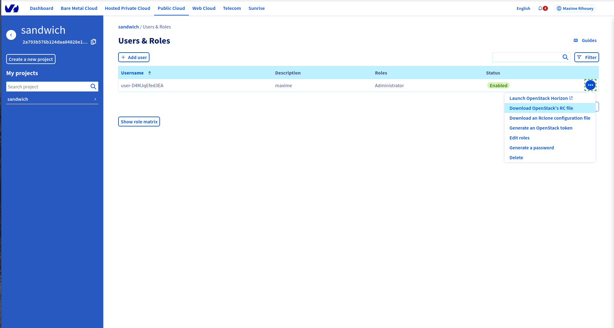
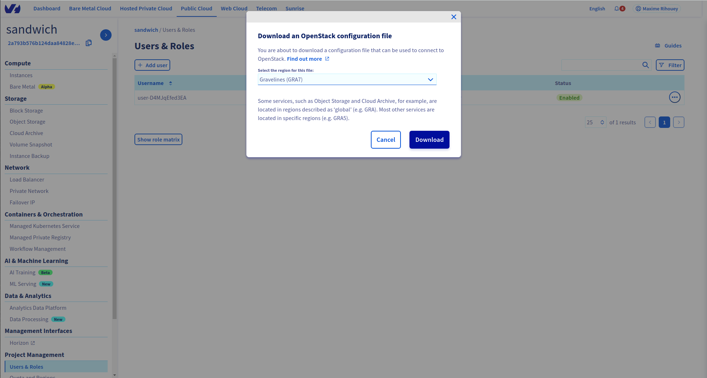
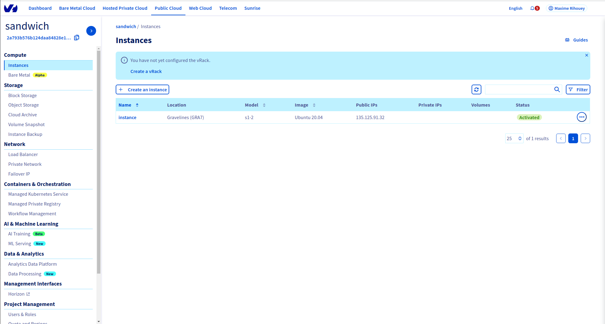
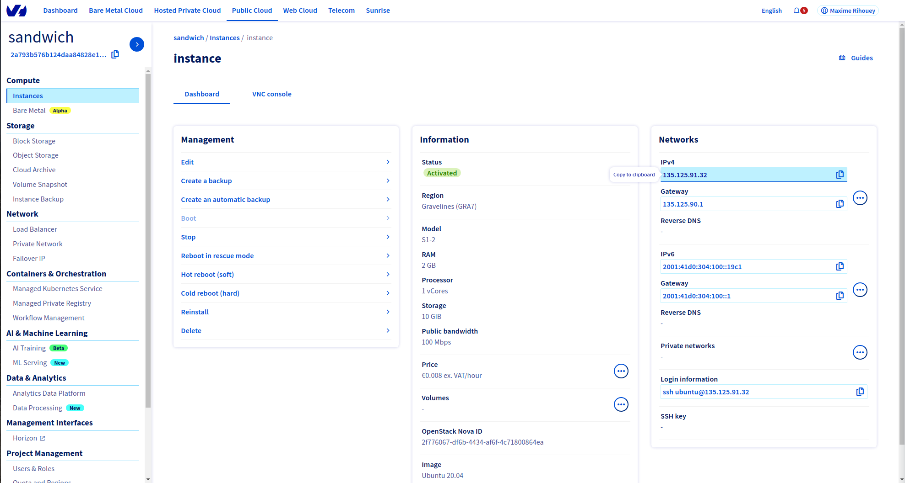
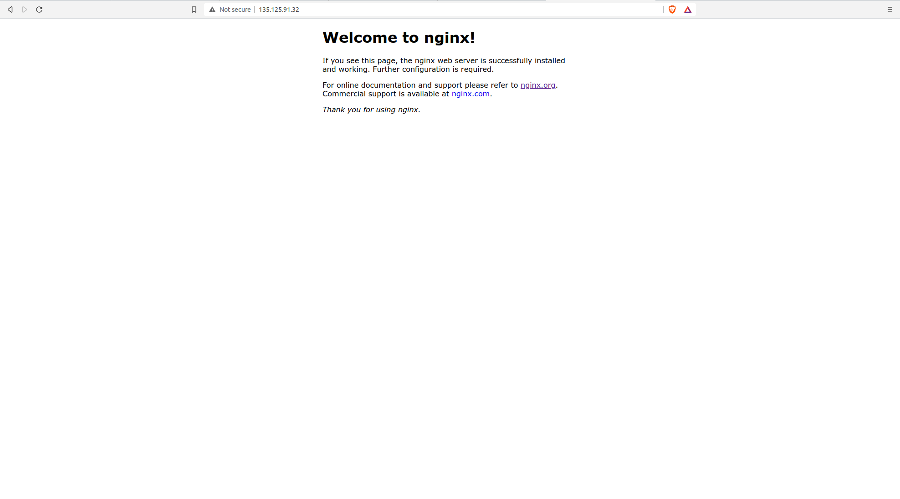

# Deploying a simple webserver on OVHcloud

This tutorial shows how to deploy a simple webserver on the OVHcloud using `terraform` and the OpenStack provider.

A few key pieces of information:
- We will deploy `out-of-the-box` NGINX servers, with no specific configuration
- We will use `terraform` in version `v0.12.30` (since the provider has not been ported to `v0.13` yet: https://github.com/terraform-provider-openstack/terraform-provider-openstack)
- We use a local `terraform` remote state
- There might be security issue having a public instance on the web, I am not an expert, so I strongly advise only keeping such instance online for testing purposes and destroying it afterwards.

### Prerequisites (things you need before starting the tutorial):
- An OVHcloud account, and a project
- An OpenStack user (https://docs.ovh.com/us/en/public-cloud/creation-and-deletion-of-openstack-user/)
- An SSH key (https://docs.ovh.com/us/en/public-cloud/create-ssh-keys/)
- A basic understanding of `terraform`

### Setting credentials for `terraform` (and `openstack`)

1. Download the `openrc.sh` for your OpenStack user

The OpenStack interface on OVHcloud let you download an executable that sets several environment variables:

 



To use it simply execute `source openrc.sh` (this will ask for your OpenStack user password).

2. Export your OpenStack user credentials as `terraform` environment variable.

In this tutorial we will use those credentials directly in the `terraform` code, instead having them clear in the code (and risking publishing it) it is better to set them as environment variables.

```
export TF_VAR_open_stack_user_name="user-D4MJqEfed3EA"
export TF_VAR_open_stack_password="XXXXXXXXXXXXXXXXXXXXXXXX"
```

## 1) Simple NGINX on a public instance

Go to the folder `1-public-nginx`.

You should see in the file `main.tf` that we are creating two resources:
- `openstack_compute_instance_v2` a VM instance where NGINX will be running (achieved using *user-data.sh*)
- `openstack_compute_keypair_v2` a KeyPair to connect to the VM instance 

The only element you might have to change is the path to the SSH KEY, you can specify it in the variable `ssh_key_location` that is defined in the file `variables.tf`.
In the `variables.tf` you can also see the usage of the credentials set up as environment variables. 

If you look closely the `user-data.sh` file is executed as "Cloud Init" meaning that it will be executed at the initialisation of the instance and all it does is installing and starting a NGINX server
```
#!/bin/bash

sudo apt-get install nginx -y
sudo systemctl start nginx
```

You can them apply the `terraform` code:
```
terraform init
terraform apply
```

You should see the instance on your OVHcloud interface (you might have to refresh the page).



The instance is published pubicly on the web and you can access it by copying and paste the IP as a URL.
Once the `user-data.sh` is fully executed you should see the bare interface of a NGINX server started.





I strongly advise destroying the instance afterwards

```
terraform destroy
```
